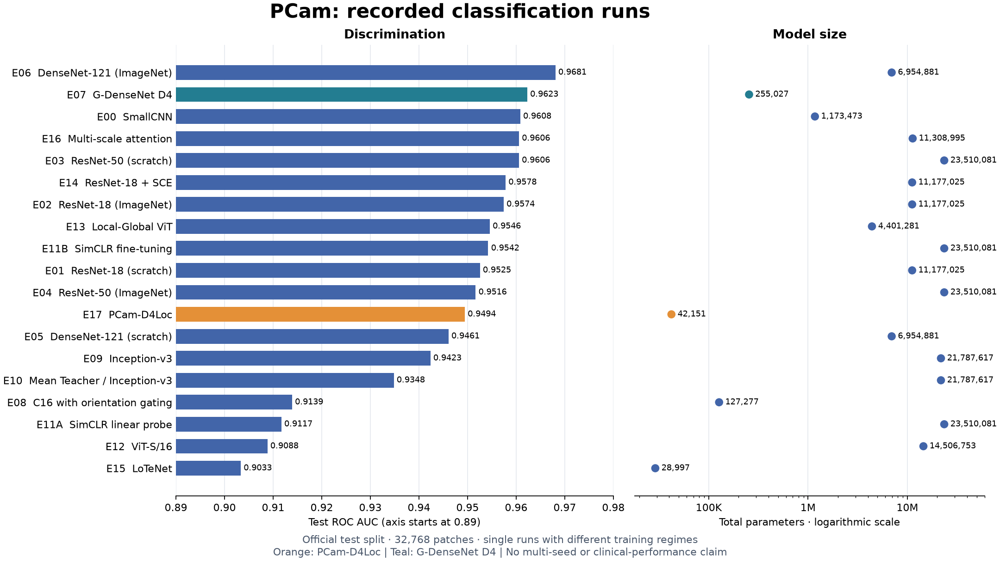
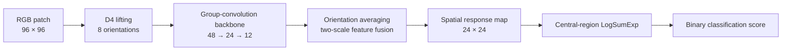

# PCam-D4Loc & Histopathology Benchmarks

**Small, symmetry-aware neural networks for lymph-node metastasis classification.**

[](pyproject.toml)
[](https://pytorch.org/)
[](LICENSE)

A research codebase for comparing neural networks on **PatchCamelyon (PCam)**:
96 × 96 histopathology patches with a binary label defined by the central
32 × 32 region. The project combines conventional CNNs, group-equivariant
networks, transformers, semi-supervised and self-supervised learning, and
an original compact architecture: **PCam-D4Loc**.

[Results](#recorded-results) · [Quick start](#quick-start) · [Methods](docs/METHODS.md) ·
[Reproducibility](docs/REPRODUCIBILITY.md) · [References](references/README.md)

## What is included

- **PCam-D4Loc:** 42,151 parameters, D4 group convolutions, two-scale feature fusion,
  and a spatial response map connected directly to the classification score.
- **A shared experiment engine:** TOML configurations, validation-based checkpoint
  selection, mixed precision, checkpoint resumption, and TensorBoard logging.
- **19 recorded classification runs:** discrimination, threshold-based metrics,
  calibration, and parameter counts in machine-readable tables.
- **Explainability tools:** Grad-CAM, Integrated Gradients, RISE, native response maps,
  D4 stability checks, randomization checks, and mask-based localization metrics.
- **A compact literature collection:** 104 extracted model/configuration results
  with source URLs and protocol information, plus selected BibTeX references.

The release contains code and curated research summaries. Datasets, trained
weights, raw predictions, and the thesis manuscript are not distributed.

## Recorded results



Selected results on the official PCam test split (**32,768 patches**):

| Experiment | Model | Parameters | ROC AUC | Average precision |
|---|---|---:|---:|---:|
| E06 | DenseNet-121, ImageNet initialization | 6,954,881 | 0.9681 | 0.9712 |
| E07 | G-DenseNet D4, trained from scratch | 255,027 | 0.9623 | 0.9659 |
| E17 | **PCam-D4Loc**, trained from scratch | **42,151** | **0.9494** | **0.9555** |

PCam-D4Loc uses approximately **165× fewer parameters** than DenseNet-121,
with lower ROC AUC in these runs. Parameter count is not a measured inference
speed or memory comparison. The native map reached a mean pixel-level AP of
**0.8275** on the **25 patches with available, non-empty tumor masks**.

These are **single-run observations**, not a state-of-the-art claim or a
multi-seed leaderboard. Runs use different training regimes. The test set was
also consulted during broader model comparison and E17 development, so an
independent evaluation remains necessary. Additional-seed and ablation
configurations are supplied, but their results are **not reported as completed**.
See the [full results and limitations](results/README.md).

## PCam-D4Loc at a glance



The classification score uses the central portion of the response map to match
PCam's label definition. The map is learned from patch labels; **it is not a
supervised segmentation mask**. [Architecture and implementation details →](docs/METHODS.md)

## Quick start

From the repository root:

```bash
git clone https://github.com/Og4rek/magisterka.git
cd magisterka
python -m venv .venv
```

Activate the environment using `.venv\Scripts\Activate.ps1` on PowerShell or
`source .venv/bin/activate` on Linux/macOS. Install the PyTorch build appropriate
for your hardware using the [official installation instructions](https://pytorch.org/get-started/locally/), then:

```bash
python -m pip install -e ".[test,analysis]"
pcam-repro list-models
```

Python 3.11+ is declared by the package. The recorded experiments used Windows,
Python 3.14, and an NVIDIA RTX 4060 Laptop GPU; the exact tested software versions
and execution caveats are in [Reproducibility](docs/REPRODUCIBILITY.md).

### Explore without training or downloading data

```bash
# Redraw the chart using the small result table shipped in this repository.
python scripts/plot_results.py

# Run unit, gradient, and invariance checks; exclude training-loop smoke tests.
python -m pytest -q -k "not one_epoch and not supervised_fit and not compile_happens"
```

### Use PCam data

Obtain the dataset from the [official PCam repository](https://github.com/basveeling/pcam)
and place its six uncompressed HDF5 files in `data/pcam/`.
The supplied [PowerShell downloader](scripts/download_pcam.ps1) verifies checksums
and handles the validation/test filename mapping in the Zenodo mirror.

```bash
pcam-repro inspect-data --root data/pcam
```

### Train or evaluate a model

The following commands are **optional and computationally expensive**; installation
and plotting do not start training.

```bash
pcam-repro train --config configs/e17_pcam_d4loc_s17.toml --device auto

# Requires a checkpoint produced locally; trained weights are not bundled.
pcam-repro evaluate --config configs/e17_pcam_d4loc_s17.toml --checkpoint runs/e17-pcam-d4loc-s17/best.pt --split test --device auto
```

`python main.py` provides the same commands as `pcam-repro`.
Run all commands from the repository root so relative dataset and checkpoint
paths resolve correctly. See [the experiment guide](docs/REPRODUCIBILITY.md)
for the full matrix, SimCLR dependencies, and resumption.

## Repository map

```text
src/pcam_repro/   Data loading, models, losses, metrics, engine, and XAI
configs/         Versioned experiment definitions and proposed follow-up runs
scripts/         Dataset preparation, experiment orchestration, XAI, and plotting
tests/           Unit, gradient, invariance, and opt-in training-loop checks
results/         Recorded classification, localization, and uncertainty summaries
references/      Selected bibliography and protocol-aware literature results
docs/            Methods and reproducibility notes
assets/          Figures rendered from the published summary tables
```

## Attribution and license

Created by **Piotr Łyczko** as part of a master's research project at
Gdańsk University of Technology. PCam-D4Loc is the author's idea, developed
through brainstorming with ChatGPT; Codex assisted with implementation.
[Acknowledgments and AI assistance](ACKNOWLEDGMENTS.md) describe the scope.

Code is available under the [MIT License](LICENSE). Dataset and referenced
publication licenses remain with their respective owners. Cite this repository
using [CITATION.cff](CITATION.cff), and cite the original methods and dataset
when using them. This is research software, not a clinically validated diagnostic system.
